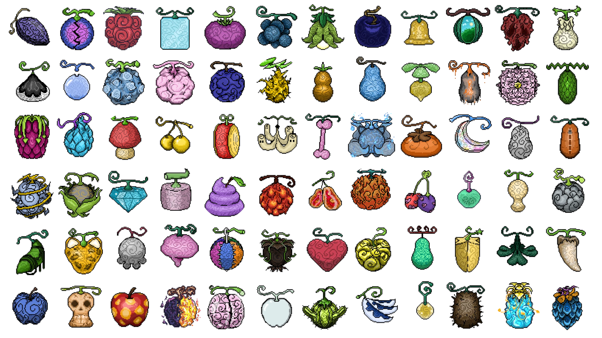

The Devil Fruit Encyclopedia API is a RESTful API built with Spring Boot that provides information about Devil Fruits from the One Piece universe. It allows users to perform CRUD operations on Devil Fruit data, including retrieving, creating, updating, and deleting Devil Fruits.

The images used for Devil Fruits are pixel art created by myself. Feel free to replace them with your own images if desired.

## Features

- Retrieve all Devil Fruits or a specific Devil Fruit by ID.
- Create new Devil Fruits.
- Update existing Devil Fruits.
- Delete Devil Fruits.
- CORS configuration for frontend integration.

## Technologies Used

- **Java**: Programming language.
- **Spring Boot**: Framework for building the API.
- **JPA/Hibernate**: ORM for database interaction.
- **H2 Database**: In-memory database for development and testing.
- **Jackson**: JSON serialization and deserialization.

## Endpoints

### Base URL

`http://localhost:8080/api/devilfruits`

### Endpoints

| Method | Endpoint           | Description                          |
|--------|--------------------|--------------------------------------|
| GET    | `/`                | Retrieve all Devil Fruits.           |
| GET    | `/{id}`            | Retrieve a Devil Fruit by ID.        |
| POST   | `/`                | Create new Devil Fruits.             |
| PUT    | `/{id}`            | Update an existing Devil Fruit.      |
| DELETE | `/{id}`            | Delete a Devil Fruit by ID.          |

## Example Request and Response

### Retrieve All Devil Fruits

**Request:**

```bash
GET /api/devilfruits
```

**Response:**

```json
[
    {
        "id": 1,
        "originalName": "Gomu Gomu no Mi",
        "romanizedName": "Gomu Gomu no Mi",
        "englishName": "Rubber Rubber Fruit",
        "meaning": "Rubber",
        "type": "PARAMECIA",
        "debutChapter": "1",
        "debutEpisode": "1",
        "debutArc": "Romance Dawn",
        "currentHolder": "Monkey D. Luffy",
        "pastHolders": [],
        "description": "Grants the user a body made of rubber.",
        "awakeningStatus": false,
        "awakeningDescription": null,
        "isCanon": true,
        "imageUrl": "http://example.com/gomu-gomu.jpg"
    }
]
```

### Create a New Devil Fruit

**Request:**

```bash
POST /api/devilfruits
Content-Type: application/json
```

**Body:**

```json
{
    "originalName": "Mera Mera no Mi",
    "romanizedName": "Mera Mera no Mi",
    "englishName": "Flame Flame Fruit",
    "meaning": "Flame",
    "type": "LOGIA",
    "debutChapter": "700",
    "debutEpisode": "629",
    "debutArc": "Dressrosa",
    "currentHolder": "Sabo",
    "pastHolders": ["Portgas D. Ace"],
    "description": "Grants the user the ability to create, control, and transform into fire.",
    "awakeningStatus": false,
    "awakeningDescription": null,
    "isCanon": true,
    "imageUrl": "http://example.com/mera-mera.jpg"
}
```

**Response:**

```json
{
    "id": 2,
    "originalName": "Mera Mera no Mi",
    "romanizedName": "Mera Mera no Mi",
    "englishName": "Flame Flame Fruit",
    "meaning": "Flame",
    "type": "LOGIA",
    "debutChapter": "700",
    "debutEpisode": "629",
    "debutArc": "Dressrosa",
    "currentHolder": "Sabo",
    "pastHolders": ["Portgas D. Ace"],
    "description": "Grants the user the ability to create, control, and transform into fire.",
    "awakeningStatus": false,
    "awakeningDescription": null,
    "isCanon": true,
    "imageUrl": "http://example.com/mera-mera.jpg"
}
```

## How to Run

1. **Clone the Repository**  
     Clone the project to your local machine using the following command:
     ```bash
     git clone "https://github.com/ben4ali/The-Devil-Fruit-Encyclopedia-API.git"
     ```

2. **Navigate to the Project Directory**  
     ```bash
     cd The-Devil-Fruit-Encyclopedia-API
     ```

3. **Build the Project**  
     Use Maven to build the project:
     ```bash
     mvn clean install
     ```

4. **Run the Application**  
     Start the Spring Boot application:
     ```bash
     mvn spring-boot:run
     ```

5. **Access the API**  
     Open your browser or API client (e.g., Postman) and navigate to:
     ```
     http://localhost:8080/api/devilfruits
     ```

### Seed the DB

Use the `Seed.json` in postman to seed the db with the premade devil fruits.

### Notes

- Make sure you set up your `.env.properties` based on `.env.samples.properties` to connect your PostgreSQL database to the API.

## Client Application

I also created a client-side React application that interacts with this API to display Devil Fruit information with a special style. You can check it out here: [The Devil Fruit Encyclopedia Client](https://github.com/ben4ali/The-Devil-Fruit-Encyclopedia-Client).


## Software License

This project is licensed under the MIT License. See the [LICENSE](LICENSE) file for details.

# Image License

All artwork and images in this repository (e.g., pixel art, Devil Fruit icons) are licensed under the **CC BY-NC-ND 4.0 License** (Attribution-NonCommercial-NoDerivatives).

This means:

- ✅ You **can** share and use the images **for personal or educational purposes**.
- ❌ You **cannot** modify, remix, or transform the images.
- ❌ You **cannot** use them for commercial purposes (e.g., sell them, use them in commercial games, merch, or paid apps).
- ✅ You **must** credit the original creator: *Ali Benkarrouch*

See: [Creative Commons BY-NC-ND 4.0](https://creativecommons.org/licenses/by-nc-nd/4.0/)

